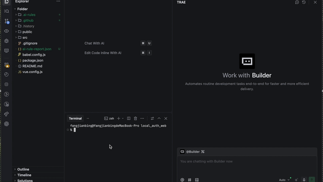
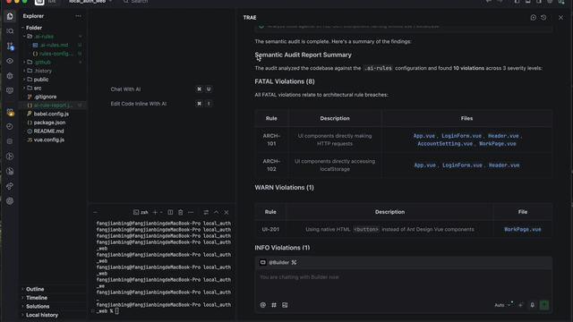

# AI-RULES

AI-RULES is a governance framework for AI-assisted coding. It turns human-readable rules (Markdown) into structured constraints and prompts, so AI agents follow your architecture, design patterns, and UI standards.

## Why It Matters
- Prevents architecture violations in AI-generated code
- Provides reusable templates per stack
- Creates a consistent audit and repair workflow
- Supports multi-language prompt rendering
AI-RULES also drives AI to auto-review code against defined rules, significantly reducing manual review effort in Human-in-the-Loop Audit Flow and improving code quality and consistency in long-running tasks.

## Quick Start
**Requires Node.js 20.19.0 or higher.**

Install AI-Rules globally:

```bash
npm install -g ai-law
```

Then navigate to your project directory and initialize:

```bash
cd your-project
# Initialize .ai-rules in a project
ai-law init

# Generate audit prompt (default locale: en)
ai-law audit

# Generate audit prompt in Chinese
ai-law audit --locale zh-CN

# Copy repair prompt for an issue
ai-law fix --issueId ISSUE-001
```

## Demo

### Audit Command

<p align="center">
	
</p>

### Report Output

<p align="center">
	
</p>

- The report includes violated rule IDs, file and line locations, precise repair prompts, and grouping by severity level.

## Project Rules Layout
The CLI generates a .ai-rules/ folder at your project root:

```text
.ai-rules/
├── .ai-rules.md
├── rules-config.json
└── base/
	├── .ai-rules.md
	└── rules-config.json
```

## Templates
Templates follow base + branch structure:
- frontend-base with react-ts and vue branches
- python-base with python-fastapi branch
- java-base with java-spring branch
- c-cpp standalone

Selecting a branch writes base rules into .ai-rules/base/ and uses extends for composition.

## Customize and Extend
1. Edit .ai-rules/.ai-rules.md for rule content
2. Edit .ai-rules/rules-config.json for scopes and enabled rules
3. Add text keys in templates/i18n/ for localization
4. Use extends to reuse base rules

## Docs
- English design spec: [docs/design-spec-en.md](docs/design-spec-en.md)
- 中文设计文档: [docs/design-spec-zh.md](docs/design-spec-zh.md)
- Repository overview: [rule.md](rule.md)
