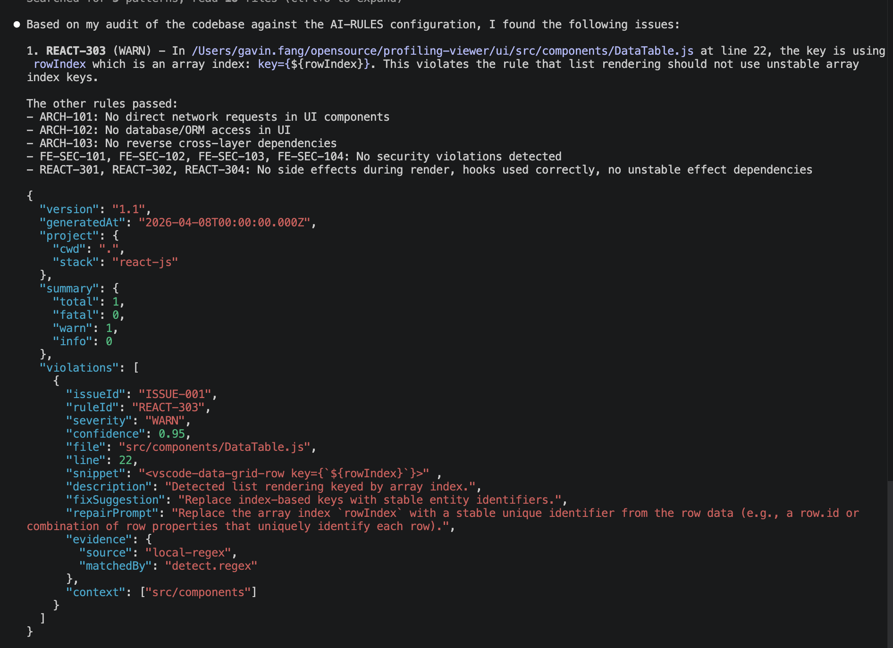
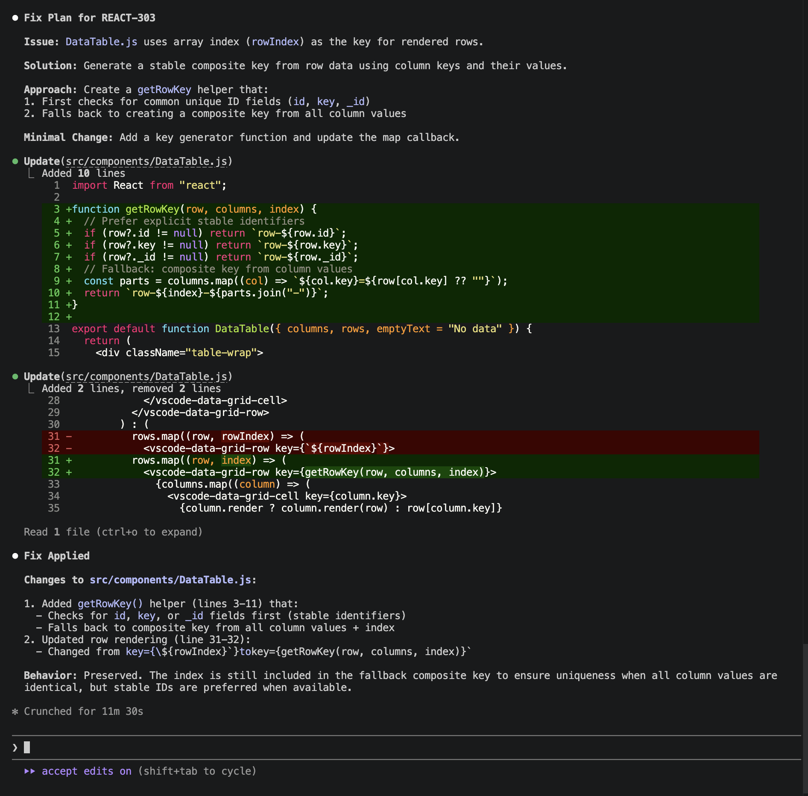

<p align="center">
  
</p>

# AI-RULES

AI-RULES is a rule-aware CLI for AI-assisted coding governance. It turns project rules in Markdown into structured rule metadata, lightweight local evidence, and deterministic audit/fix prompts so AI coding agents follow your architecture, design patterns, and UI standards more consistently.

## Why AI-RULES

AI coding agents are powerful, but they often write "generally correct" code instead of code that fits your repository's real architecture. They may call data layers from UI components, bypass service boundaries, ignore project-specific directories, leak secrets in logs, or return audit reports in shapes that downstream repair flows cannot reliably consume.

AI-RULES gives those agents a project-local operating contract before code reaches review, CI, or merge gates. It packages your engineering standards into `.ai-rules.md`, `rules-config.json`, and `config.json`, then turns them into rule-aware audit and fix prompts with enabled rules, severity thresholds, local evidence, path aliases, exceptions, and repair guidance.

The practical benefits are:

- AI-generated code is more likely to follow your architecture and layering rules from the start.
- Reviews become faster because repeated violations are encoded once instead of explained every time.
- Prompts become more deterministic because rules, paths, severity, and report schema are structured.
- Non-standard repository layouts are handled through `config.json` path aliases instead of editing every rule.
- Audit and repair workflows become more stable across Codex, Cursor, Claude Code, or any prompt-driven coding setup.

In short: repository governance tools protect the merge boundary; AI-RULES guides the AI while it is still writing and repairing code.

## What It Does

- Initializes reusable rule templates for different stacks
- Parses `.ai-rules/.ai-rules.md` and `rules-config.json`
- Merges `extends` chains for rules and config
- Resolves high-level AST config from template defaults, detected project config, and local AI-RULES overrides
- Collects lightweight local evidence for `regex` and `import/include` style rules
- Collects lightweight local evidence for minimal `count` rules such as `function-lines` and `params-count`
- Collects AST-backed local evidence for a first supported slice of frontend JS/TS/Vue rules
- Supports config-level `thresholds` for active parameterized rule behavior
- Supports config-level `exceptions` to suppress known-safe files per rule pattern
- Generates rule-aware audit prompts instead of static prompt text
- Normalizes and validates `ai-rule-report.json`
- Generates stronger fix prompts using both the report and local rule metadata

## High-Value Built-In Coverage

Current templates already cover a first batch of high-priority engineering rules in addition to the original architecture baseline.

### Frontend / React / Vue

- First AST-backed frontend local evidence is now supported for selected JS/TS rules
- UI code must not call network or data layers directly
- Raw HTML injection via `innerHTML` / `dangerouslySetInnerHTML` is flagged and can now produce AST-backed local evidence
- Semantic XSS flows from untrusted rich content into DOM sinks are called out
- Dynamic execution via `eval()` / `Function()` is flagged and can now produce AST-backed local evidence
- Hardcoded frontend secrets / API keys are flagged
- Third-party HTML script tags without SRI are flagged
- Hooks must follow React hook call rules
- React lists should not use array index as `key`, with AST-backed local evidence for supported React files
- React effect-driven remote requests should use stable dependency control
- Vue `computed` must stay pure
- Vue props must not be mutated directly, with AST-backed local evidence for supported `.vue` files
- Vue lists should not use loop index as `:key`, with AST-backed local evidence for supported `.vue` files
- Direct DOM access in Vue components is discouraged

### Python Base / FastAPI

- Bare `except` and broad swallowed exceptions are discouraged
- Mutable default arguments are flagged
- Weak password hashing algorithms such as MD5/SHA1 are flagged
- Logging patterns that may leak sensitive values are flagged
- External HTTP calls should define explicit timeouts
- Python functions should stay below configured line-count thresholds
- Python function signatures should stay below configured parameter-count thresholds
- FastAPI routes should not access repositories or DB sessions directly
- SQL built through interpolation/concatenation in FastAPI code is flagged
- FastAPI request logging must avoid tokens, cookies, auth headers, and raw credentials
- FastAPI endpoints should use Pydantic input models
- FastAPI endpoints should declare explicit `response_model`
- List-style FastAPI endpoints should enforce pagination or limit bounds
- Async paths should avoid blocking HTTP clients and `time.sleep`

### Java / Spring

- Controllers should not depend on repositories directly
- Controllers should stay thin and avoid business branching/orchestration
- `@Valid` should guard `@RequestBody` inputs
- Overly permissive CORS is flagged
- Exception handlers that may leak stack traces are flagged
- Logging patterns that may expose credentials are flagged
- Sensitive Spring endpoints should have explicit authn/authz coverage
- Overly permissive Spring Security config such as broad `permitAll()` or global protection disablement is flagged
- Write paths should define transaction boundaries
- `@Transactional` should not live on controllers
- Write-oriented service logic should keep explicit transaction semantics
- Loops should not perform unbounded remote calls without batching, timeouts, and concurrency control
- Business exceptions should stay distinct from system/infrastructure failures

## Current Scope

AI-RULES is not a full static analysis engine yet.

- `regex` and `import/include` detection can collect local evidence
- minimal `count` detection can collect local evidence for `function-lines` and `params-count`
- selected frontend `ast` rules can now produce parser-backed local evidence
- unsupported `ast` rules and `semantic` rules remain AI-guided and treated as `ai-only`
- The CLI helps structure context and outputs, while the AI still makes the final audit decision

## Language Support

Built-in locale files are available for:

- `zh-CN`: Simplified Chinese, complete
- `en`: English, complete
- `zh-TW`: Traditional Chinese, partial, falls back to English
- `ja`: Japanese, partial, falls back to English
- `ko`: Korean, partial, falls back to English
- `es`: Spanish, partial, falls back to English
- `fr`: French, partial, falls back to English

The partial locales currently translate the core template names and prompt instructions. Missing rule-level text automatically falls back to English so new languages remain usable while translations are expanded over time.

## Installation

Requires Node.js `>=18`.

Install globally:

```bash
npm install -g ai-law
```

Or for local development in this repository:

```bash
npm install
npm test
```

## Quick Start

```bash
cd your-project

# 1. Initialize rules in the current project
ai-law init

# 2. Check that rules/config are valid
ai-law doctor

# 3. Generate a rule-aware audit prompt
ai-law audit

# 4. `audit` also writes local helper files by default
#    - .ai-rules/cache/audit-context.json
#    - .ai-rules/cache/ai-rule-report.template.json

# 5. Or inspect the structured audit context directly
ai-law audit --json

# 6. Optionally force a fresh context dump
ai-law audit --dump-context

# 7. After your AI tool produces ai-rule-report.json, validate it
ai-law validate-report

# 8. Generate a fix prompt for one issue
ai-law fix --issueId ISSUE-001

# 9. Or generate a grouped fix prompt for the whole report
ai-law fix --all --group-by-rule
```

## Workflow

### 1. Initialize

`ai-law init` creates a `.ai-rules/` directory in your project and materializes the selected template.

Example layout:

```text
.ai-rules/
├── .ai-rules.md
├── rules-config.json
├── config.json
├── base/
│   ├── .ai-rules.md
│   ├── rules-config.json
│   └── config.json
└── cache/
    ├── audit-context.json
    └── ai-rule-report.template.json
```

### 2. Validate Local Rule Setup

`ai-law doctor` validates:

- `.ai-rules/` exists
- `rules-config.json` can be loaded and merged through `extends`
- the rules file can be parsed
- `enabledRuleIds` point to real rules
- rule scopes match config scopes
- required rule fields exist

Use `ai-law doctor --strict` to treat warnings as failures.

### 3. Generate Audit Context

`ai-law audit` now reads the current project rules and builds a prompt from:

- merged config
- parsed rules
- enabled rule IDs
- local evidence candidates
- strict report schema requirements

Useful variants:

```bash
ai-law audit --locale zh-CN
ai-law audit --json
ai-law audit --summary
ai-law audit --dry-run
ai-law audit --dump-context
```

`--json` prints the structured audit context instead of a prompt.

By default, `ai-law audit` writes:

- `.ai-rules/cache/audit-context.json`
- `.ai-rules/cache/ai-rule-report.template.json`

Use the generated prompt with your AI tool, then save the AI result as `ai-rule-report.json` in the project root.
The cached audit context now includes stable `evidenceId` / `matchId` values so AI reports can reference concrete local evidence records.

`--dump-context` forces a fresh write of `.ai-rules/cache/audit-context.json`.
`--summary` prints enabled-rule counts, local-vs-AI coverage, suppressed files, and configured thresholds.
`--dry-run` prints include/exclude patterns, rule IDs that can run locally, AI-only rule IDs, and active exception patterns.

<p align="center">
  
</p>

Audit report example: the AI returns a structured `ai-rule-report.json` that can be validated and fed into the next repair step.

### 4. Validate The AI Report

After your AI tool returns `ai-rule-report.json`, run:

```bash
ai-law validate-report
```

This command normalizes legacy or drifted report shapes into a stable structure and checks for issues like:

- missing `issueId`
- missing `ruleId`
- duplicate `issueId`
- invalid `severity`
- unknown `evidenceId` / `matchId` references when `.ai-rules/cache/audit-context.json` is available

You can inspect the normalized report with:

```bash
ai-law validate-report --json
```

### 5. Generate Fix Prompts

`ai-law fix` now combines:

- normalized report data
- local rule metadata from `.ai-rules`
- rule intent / requirement / fix guidance
- context assets
- report evidence and snippets when present

When you run `ai-law fix --all`, issues are ordered deterministically:

- `FATAL` before `WARN` before `INFO`
- then by file and line
- `--group-by-rule` keeps grouping while preserving stable ordering between groups

Examples:

```bash
ai-law fix --issueId ISSUE-001
ai-law fix --id ARCH-101
ai-law fix --all
ai-law fix --all --group-by-rule
```

<p align="center">
  
</p>

Fix prompt example: `ai-law fix` turns one or more report entries into a focused, patch-oriented repair prompt with rule context and evidence.

## Rule Model

Rules are defined in `.ai-rules.md` using `RULE` blocks. The CLI currently parses fields such as:

- `RULE`
- `severity`
- `scope`
- `intent`
- `fix`
- `detect`
- `prompt`
- `context`
- `extends`

Example:

```md
### RULE: ARCH-101
severity: FATAL
scope: ui
intent: UI components must not initiate network requests directly.

detect:
  regex: "fetch\\(|axios\\."
  where: filePath in src/components/**
fix: Move request logic into a service layer.
prompt:
  violation: Detected direct request logic in UI layer.
  requirement: UI components must not contain request logic.
  solution: Move requests to a service and reuse shared clients.
context:
  - src/services/
  - src/api/client.ts
```

## Project Path Config

Templates can provide an optional `.ai-rules/config.json` file for user-specific project layout overrides. This file is merged on top of `rules-config.json`, so users can adjust directory conventions without editing every rule.

Example:

```json
{
  "pathAliases": {
    "@controller": "app/controllers",
    "@service": "app/services",
    "@repository": "app/repositories",
    "@config": "app/config"
  }
}
```

Rules can reference those aliases in `context`, `detect.where`, `detect.import`, and `detect.include`:

```md
detect:
  include: "@repository/**"
  where: filePath in @controller/**
context:
  - @service
```

At audit/fix time, the CLI resolves aliases before collecting evidence or building prompts.

`ai-law doctor` and `ai-law audit` warn prominently when a configured alias points to a path that does not exist. If this happens, open `.ai-rules/config.json` and adjust `pathAliases` to match your repository layout.

## Detection Support

Current support in the CLI:

- `detect.regex`: local evidence collection supported
- `detect.import`: local evidence collection supported
- `detect.include`: local evidence collection supported
- `detect.ast`: first frontend AST-backed rules now support local evidence
- `detect.semantic`: AI-only for now

Current AST-backed local evidence focuses on frontend JS/TS projects and covers the first narrow batch of rules:

- direct network calls from UI entry code such as `fetch()` / `axios.*`
- raw HTML injection such as `dangerouslySetInnerHTML` / `innerHTML`
- dynamic code execution such as `eval()` / `Function()`
- React list rendering keyed by loop index
- Vue props mutation in `.vue` script blocks
- Vue list rendering keyed by loop index in `.vue` templates
- TypeScript `any` usage in TS/TSX files

This means the CLI can now attach concrete local evidence for regex/import/include/count and a first slice of AST-backed frontend rules across React and Vue, while still allowing AI-guided review for higher-level semantic constraints and unsupported AST rules.

The current templates intentionally mix:

- fast local rules for obvious anti-patterns
- semantic AI-guided rules for higher-level architectural or transactional reasoning

## Config Extensions

The config model now supports two rule-aware extensions:

### `ast`

Used for high-level AST backend orchestration. AI-RULES keeps this config intentionally small and merges it with detected project config at runtime.

Example:

```json
{
  "ast": {
    "provider": "babel",
    "target": "react",
    "useProjectConfig": true,
    "parserOptions": {
      "sourceType": "module",
      "plugins": ["jsx", "typescript"]
    }
  }
}
```

At runtime, AI-RULES resolves AST settings in this order:

1. template defaults
2. detected project config such as `tsconfig.json` / `.babelrc` / `package.json#babel`
3. local `.ai-rules/config.json` overrides

### `thresholds`

Used for configurable numeric limits that active local count rules can reference.

Example:

```json
{
  "thresholds": {
    "maxFunctionLines": 80,
    "maxParamsCount": 5,
    "maxListLimit": 100
  }
}
```

### `exceptions`

Used to suppress known-safe files for matching rule IDs or rule ID patterns during local evidence collection.

Example:

```json
{
  "exceptions": {
    "ARCH-101": [
      "src/integrations/**"
    ],
    "SEC-*": [
      "__mocks__/**",
      "**/*.stories.tsx"
    ]
  }
}
```

These exceptions currently affect local evidence collection for supported local detect modes.

## Report Shape

The audit prompt requests strict JSON with a normalized structure like:

```json
{
  "version": "1.1",
  "generatedAt": "2026-03-30T12:00:00Z",
  "project": {
    "cwd": ".",
    "stack": "react-ts"
  },
  "summary": {
    "total": 1,
    "fatal": 0,
    "warn": 1,
    "info": 0
  },
  "violations": [
    {
      "issueId": "ISSUE-001",
      "ruleId": "ARCH-101",
      "severity": "WARN",
      "confidence": 0.82,
      "file": "src/pages/Home.tsx",
      "line": 12,
      "snippet": "const data = fetch('/api')",
      "description": "Direct network request found in UI layer.",
      "fixSuggestion": "Move request logic into services.",
      "repairPrompt": "Provide a minimal patch...",
      "evidence": {
        "source": "local-regex",
        "matchedBy": "detect.regex"
      },
      "context": [
        "src/services/"
      ]
    }
  ]
}
```

## Templates

Current templates:

- `frontend-base`
  - `react-js`
  - `react-ts`
  - `vue`
- `python-base`
  - `python-fastapi`
- `java-base`
  - `java-spring`
- `c-cpp`

Branch templates inherit from base templates through `extends`.

## CLI Commands

```bash
ai-law init
ai-law audit [--locale <code>] [--json] [--summary] [--dry-run] [--dump-context]
ai-law fix --issueId <issue_id>
ai-law fix --id <rule_id>
ai-law fix --all [--group-by-rule]
ai-law doctor [--strict]
ai-law validate-report [--json] [--path <file>]
ai-law setup [--locale <code>] [--provider <name>] [--write]
ai-law -v
ai-law -h
```

## Development Notes

Current implementation layers:

- `cli/src/core/config`: config loading and `extends` merge
- `cli/src/core/rules`: rule parsing and validation
- `cli/src/core/evidence`: local evidence collection
- `cli/src/core/prompt`: audit prompt assembly
- `cli/src/core/report`: report normalization and schema

Run tests:

```bash
npm test
```

## Docs

- English design spec: [design/design-spec-en.md](design/design-spec-en.md)
- 中文设计文档: [design/design-spec-zh.md](design/design-spec-zh.md)
